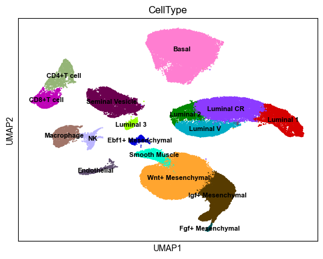
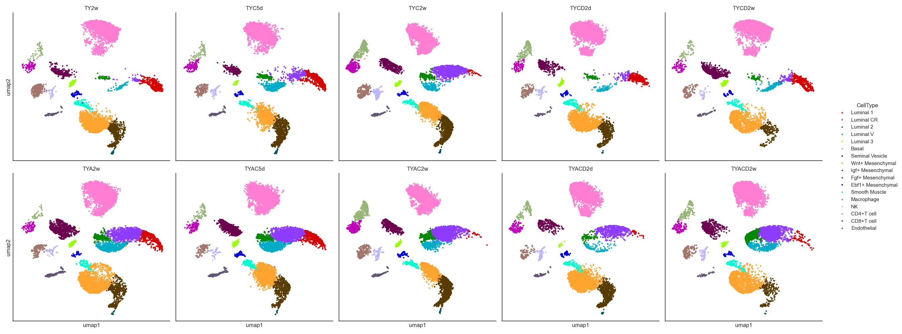

# ARKO_single_cell_RNAseq
This repository contains our single cell RNAseq data of the ARKO project

 

[]

| Nomenclature | Treatment |
| :--- | :--- |
| **TY2w** (or TYA2w) | Tamoxifen 2 weeks |
| **TYC5d** (or TYAC5d) | Tamoxifen 2 weeks; castration 5 days |
| **TYCD2d** (or TYACD2d) | Tamoxifen 2 weeks; castration 5 days; DHT 2 days |
| **TYCD2w** (or TYACD2w) | Tamoxifen 2 weeks; castration 5 days; DHT 2 weeks |